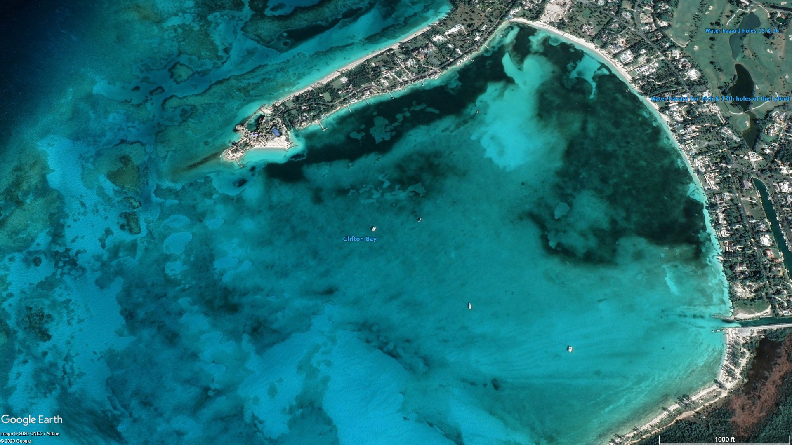

# Object Detection
simple object detection of boats using [`imageai`](https://github.com/OlafenwaMoses/ImageAI)

## Instructions

### Virtual Environment (Optional)
`mkdir virtual-env`

`python3 -m venv virtual-env`

`. virtual-env/bin/activate`

### Python Object Detection
`pip3 install -r requirements.txt`

`wget https://github.com/OlafenwaMoses/ImageAI/releases/download/essential-v4/pretrained-yolov3.h5`

`python3 detect-trainer.py`

`python3 detect-evaluator.py`

`python3 detect-tester.py`

### Research Links
- [Preparing Your Data Set](https://medium.com/deepquestai/object-detection-training-preparing-your-custom-dataset-6248679f0d1d)
- [Training With Your Own Data Set](https://medium.com/deepquestai/train-object-detection-ai-with-6-lines-of-code-6d087063f6ff)
- [Object Detection Machine Learning](https://towardsdatascience.com/object-detection-with-10-lines-of-code-d6cb4d86f606)

